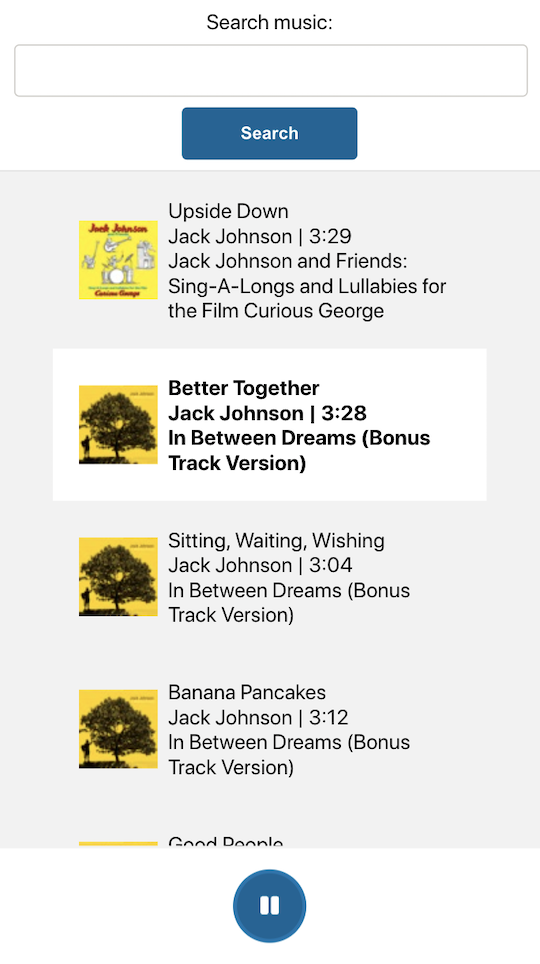
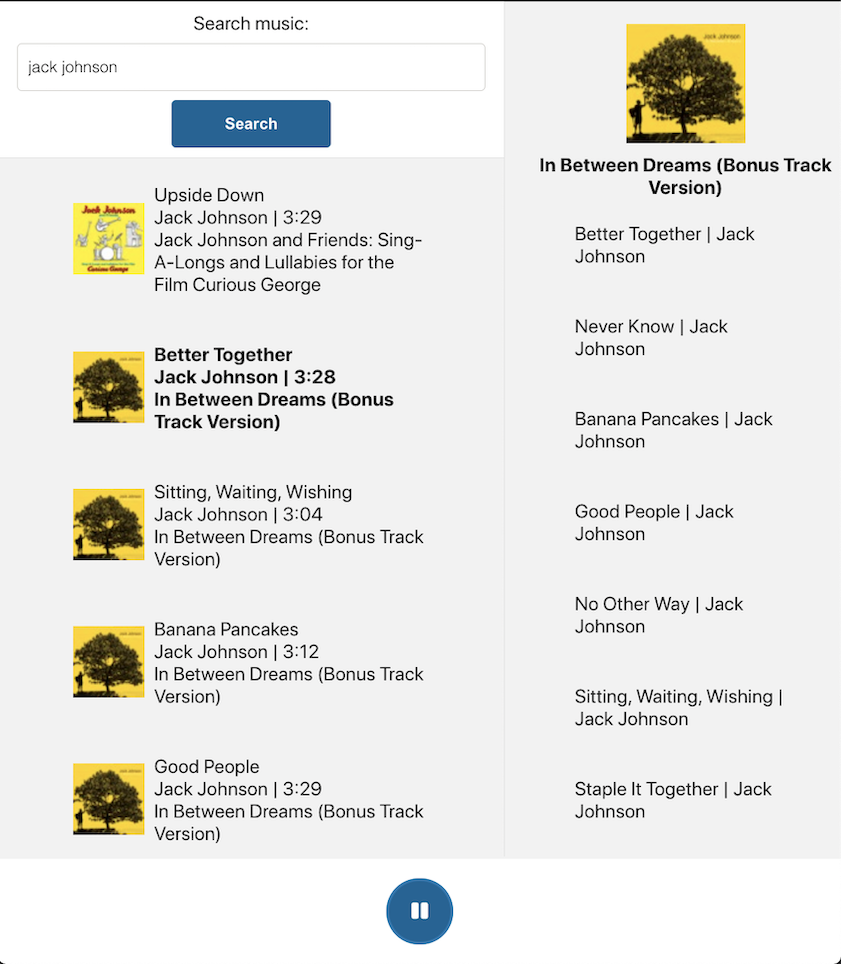
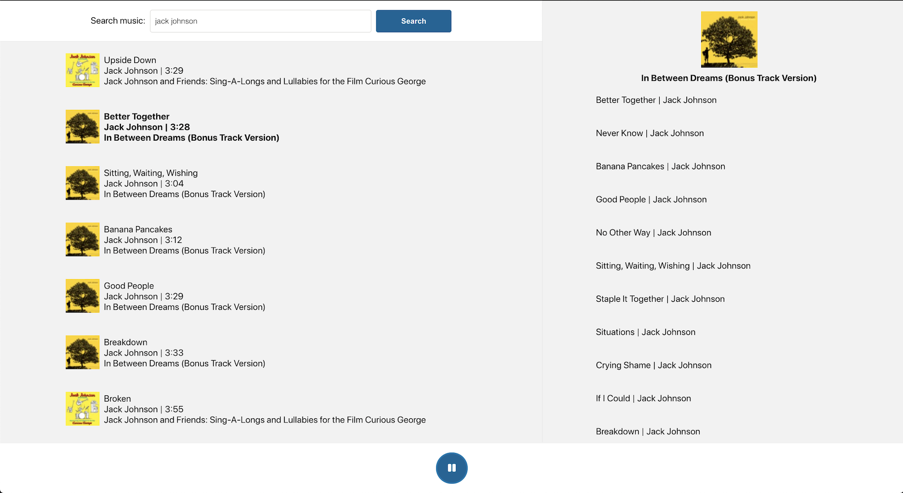

# Music player
- Mobile view

- iPad/Tablet view

- Desktop view

# Running the app
## Prerequisites
- Must run on React 16 or tests will break.
- Must run on Node v12 or higher.

## Starting the app

-  In `/app`, `npm i` to install packages
-  Run `npm start` to build and run the front end on port `3000`
-  Go to http://localhost:3000/.

## Starting the server
-  In `/server`, `npm i` to install packages
-  Run `npm start` to build and run the server on port `4000`
-  Live at http://localhost:4000/.

## Running tests

-  In `/app` run `npm test` to run the tests using `jest`.
-  In `/server` run `npm test` to run the tests using `ava`.

## Documentation

-  JSDoc has been used for documenting the node server. Run `./node_modules/.bin/jsdoc File.js` on any given file to view.

# Decision making
## Accessibility decisions

- Use of lists (`<ol>, <li>`) for tracks. This allows screen reader to understand how many items are in the list, and announce indexing as it reads each item.
    - https://www.w3.org/WAI/WCAG21/Techniques/html/H48
- Use of "role=button" on lists
    - https://developer.mozilla.org/en-US/docs/Web/Accessibility/ARIA/Roles/button_role?fbclid=IwAR0xEAOiZt5L-Z7wIp3hxp5dV6HaHD9-oGwAe0uLqZz0KuU2W7YcRud-hfk#accessibility_concerns

## Other decisions
- Didn't use censored versions of track names and albums. Do your best.
- Enabled auto search as user is typing in the search bar.
- Kept the media controls at the bottom of the page as is consistent with other web music players.

## Trade offs
- Used `create-react-app` to save time. I know it's your fav @Chris.

- Search Bar: I added search button (although it auto searches as you type) and didn't remove the label/add a place holder (typical nice design items) to save time.

- Spent an hour playing with Howler.js wondering why I couldn't get the `sound.stop()` or `sound.pause()` funcs to work. Turns out it doesn't work with React. Ended up using `ReactHowler` which isn't as nice (i.e. stopping functionality is strange to implement).

- I used the preview urls rather than the full songs due to API restrictions.

- Spent a bit of time on design to make it look *acceptable*. However, I would usually spend a bit more time to make sure it looked nice on both mobile and desktop.

- Auto search is a bit slow - give it a couple of seconds to load if the results seem incorrect. The request also occasionally gets rejected as the iTunes API doesn't return any results (e.g. searching for "jack johnso" returns an empty array - have checked via postman to ensure this is not my endpoint). This does not impact the overall experience (i.e. no breaking error state), and is a limitation of the iTunes API.

- Could not get `TrackList.spec.jsx` tests working. This is due to the fact that I call an external URL then set the state in the `useEffect`. This causes issues and warnings about using `act` (see test for more info). While I couldn't fix the problem, I'm well aware of a bigger refactor I could have undertook to fix it. This problem (and many others across my app) could be fixed if I had used `Redux Saga` to call the external URL instead and managed the side effects using `actionCreators`. This would allow me to easily mock the call to the API in the tests using jest mocks. It would also allow components to access global state, rather than managing shared state in the parent component `MusicPlayer`. This prevents unnecessary re-rendering of components as they only access and manage the state that they need to render (e.g. in the current setup without Redux `TrackList` would re-render upon an `AlbumList` related change, decreasing performance). I chose not to use Redux + Redux Saga as you mentioned they weren't used in your organisation, but found a whole heap of problems I'd never encountered before. Definitely something I'll have to look more into.

# Assumptions
There were specifications where I wasn't 100% sure what they were asking for. I made assumptions as follows:

- `The selected song’s preview should not play automatically, it should simply display the details and let user play the song preview if they wish.`: I assumed this meant when it's searched the list of songs that comes up are the "preview songs". They have to be clicked to play the song.
- `If a song is playing and a different song is selected from the left hand side, the song should keep playing, however the right hand side should display details for the song selected.`: I assumed that this was relating to if the album list tracks were clickable. They are not in my project so I did not implement this.

## Feature gaps I'd add in for a bigger project:
- Next and back buttons
- Song timeline/progress bar
- Queueing
- Favouriting

# Supported browsers
- Google Chrome
- Google Canary
- Firefox
- (When using Google dev tools) Pixel, Pixel XL, iPad, iPad Pro, iPhone 6/7/8 Plus

NOTE: I tested all the above at >=100% magnification. I didn't support any lower levels of magnification (<100%).
